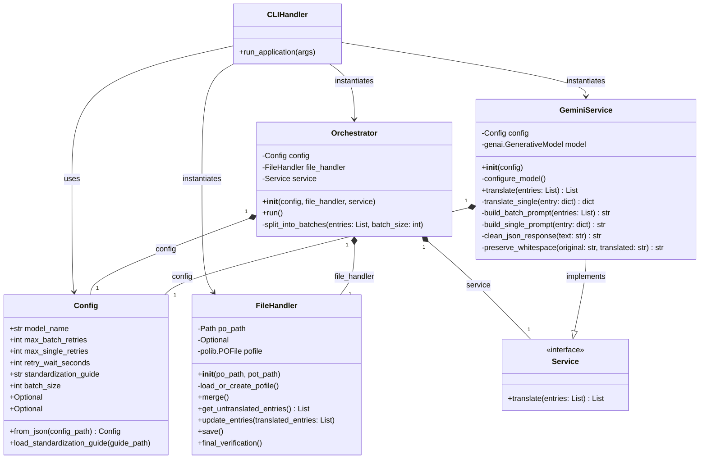
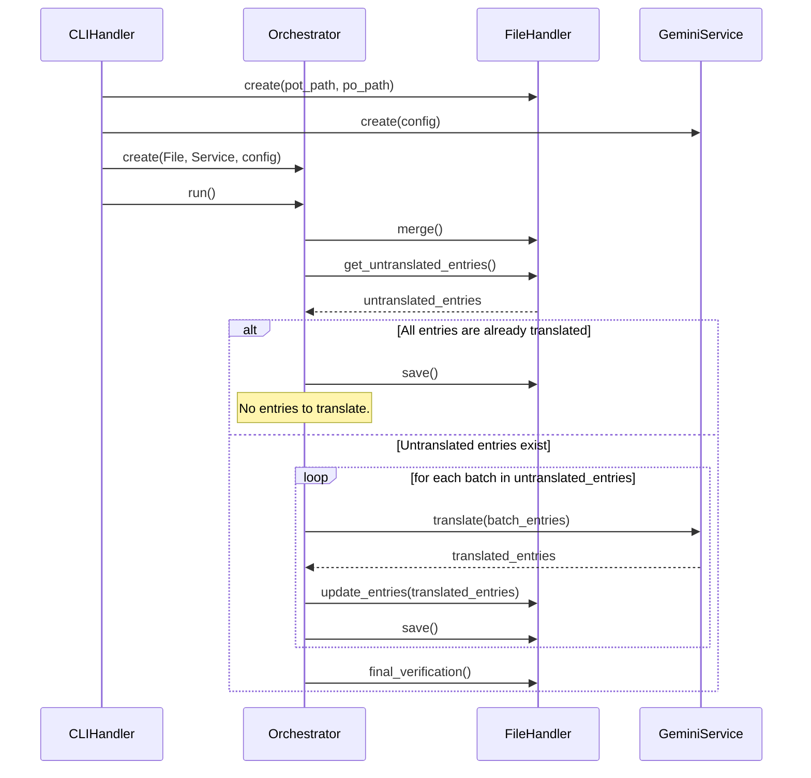

# Architecture Guide

This document describes the overall architecture and design principles of the `translation_hub` application.

## Design Principles

The system is designed following a **Layered Architecture** pattern. This separates concerns into distinct, independent components, making the codebase more modular, testable, and extensible.

The four main layers are:

1.  **Presentation Layer (CLI)**: Handles user interaction.
2.  **Orchestration Layer**: Coordinates the components to execute the translation workflow.
3.  **Service Layer**: Manages external services, primarily the translation API.
4.  **Data Access Layer**: Handles all interactions with the filesystem.

## Core Components (Classes)

- **`CLIHandler` (`main.py`)**: The application's entry point. Its sole responsibility is to parse command-line arguments, instantiate the necessary components, and trigger the orchestration layer.

- **`Orchestrator`**: The "brain" of the application. It coordinates the entire translation process, including:
  - Requesting untranslated entries from the `FileHandler`.
  - Splitting entries into batches.
  - Sending batches to the `Service`.
  - Updating the `FileHandler` with the results.
  - Saving progress.

- **`Service` (Abstract Base Class)**: Defines a common interface for any translation service. This allows for future extensibility (e.g., adding DeepL or Azure Translator).

- **`GeminiService`**: The concrete implementation of `Service` for the Google Gemini API. It handles:
  - API authentication and model configuration.
  - Building a detailed prompt that includes not just the text to translate but also its **context** (source file occurrences, developer comments, etc.).
  - Executing the API call, including retry and fallback logic.
  - Parsing the JSON response.

- **`FileHandler`**: Encapsulates all logic related to file manipulation using the `polib` library. Its responsibilities include:
  - Loading and creating `.po` files.
  - Merging `.pot` templates.
  - Extracting untranslated/fuzzy entries as dictionaries containing the `msgid` and its `context`.
  - Saving changes to disk.

- **`Config`**: A data class that holds all configuration parameters, such as API keys, batch sizes, and file paths.

## Execution Flow

