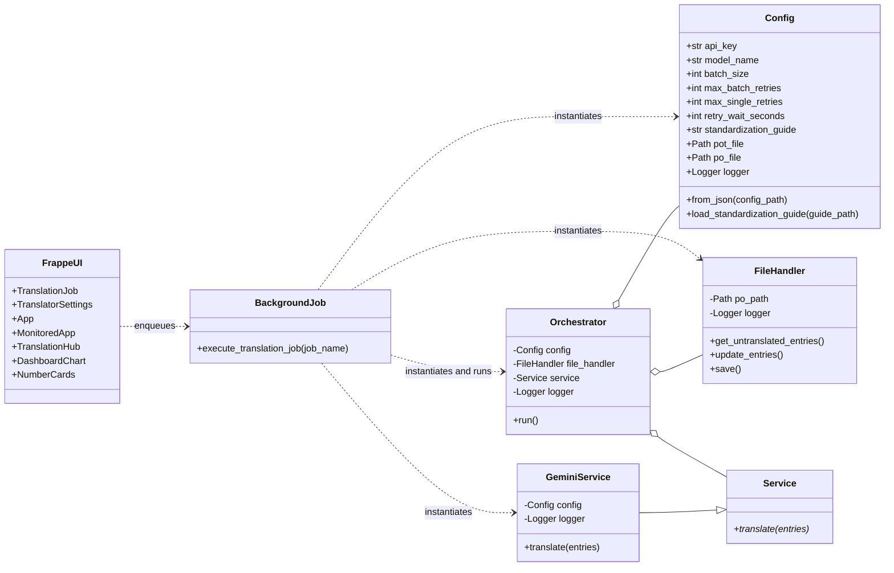
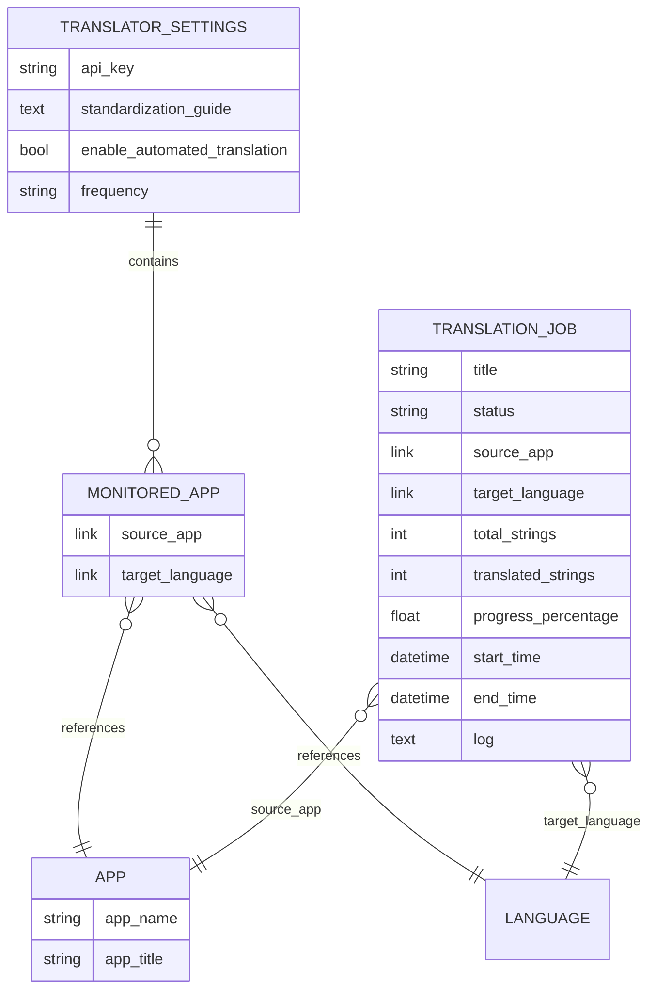
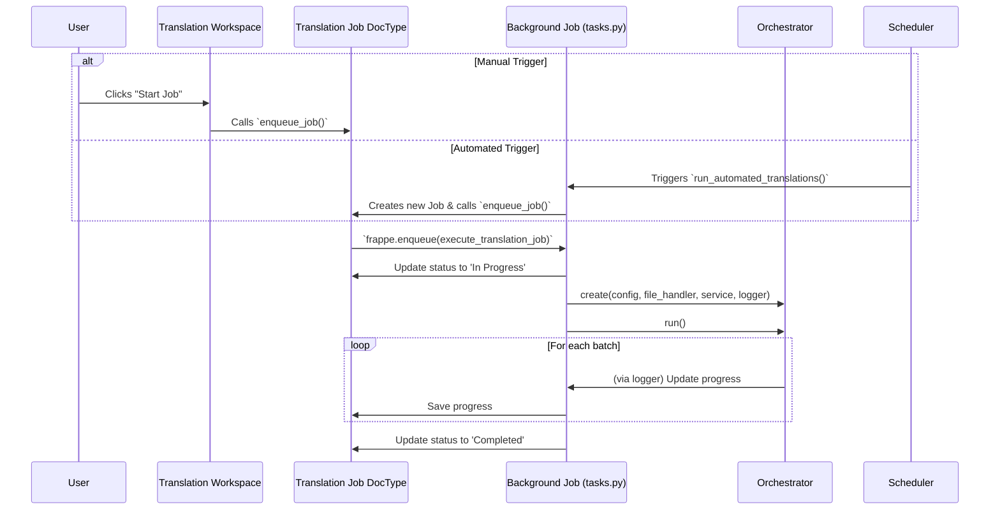

# Architecture Guide

This document describes the overall architecture and design principles of the `translation_hub` application.

## Design Principles

The system is designed following a **Layered Architecture** pattern. This separates concerns into distinct, independent components, making the codebase more modular, testable, and extensible.

The four main layers are:

1.  **Presentation Layer (Frappe UI)**: Handles user interaction through Frappe DocTypes and a custom Desk Page.
2.  **Application Layer (Frappe Backend)**: Manages the business logic, including DocType controllers, background jobs, and the scheduler.
3.  **Core Logic Layer**: Contains the domain-specific logic for the translation process. This layer is independent of the Frappe framework.
4.  **Service & Data Access Layer**: Manages external services (translation API) and filesystem interactions (`.po` files).

## Core Components

### Frappe Components

#### DocTypes

- **`Translator Settings` (Singleton DocType)**: Stores global configuration like API keys, automation settings, and monitored apps.
  - Contains child table `Monitored App` for automated translation configuration
  - Fields: `api_key`, `standardization_guide`, `enable_automated_translation`, `frequency`, `monitored_apps`

- **`Translation Job` (Standard DocType)**: Represents a single translation task, tracking its status, progress, timing, and logs.
  - Links to `App` (source application) and `Language` (target language)
  - Tracks progress metrics: `total_strings`, `translated_strings`, `progress_percentage`
  - Records timing: `start_time`, `end_time`
  - Maintains execution log for debugging and monitoring
  - Status values: Pending, Queued, In Progress, Completed, Failed, Cancelled

- **`App` (Standard DocType)**: Represents a Frappe/ERPNext application available for translation.
  - Stores `app_name` (unique identifier) and `app_title` (display name)
  - Referenced by `Translation Job` and `Monitored App`
  - Used to track which applications are being translated

- **`Monitored App` (Child Table)**: Defines app/language combinations to monitor for automated translation.
  - Part of `Translator Settings.monitored_apps`
  - Links to `App` (source application) and `Language` (target language)
  - Used by scheduler to automatically create translation jobs when untranslated strings are detected

#### Workspace & UI Components

- **`Translation Hub` (Workspace)**: A dashboard for creating, managing, and monitoring Translation Jobs.
  - Displays **Dashboard Chart**: "Translations Over Time" - visualizes translation progress over time
  - Displays **Number Cards** for key metrics:
    - **Total Apps Tracked**: Count of apps configured for translation
    - **Jobs in Progress**: Active translation jobs currently running
    - **Jobs Completed (30 Days)**: Successfully completed jobs in the last 30 days
    - **Strings Translated**: Total number of strings translated across all jobs

#### Background Jobs

- **Background Job (`tasks.py`)**: Functions enqueued by Frappe's scheduler or manually from the UI.
  - **`execute_translation_job(job_name)`**: Runs the translation process for a specific job
    - Updates job status (Queued → In Progress → Completed/Failed)
    - Instantiates and runs the `TranslationOrchestrator` with core logic components
    - Logs progress and errors to the job document
  - **`run_automated_translations()`**: Checks monitored apps and creates jobs automatically
    - Triggered by Frappe scheduler based on configured frequency
    - Scans for untranslated strings in monitored app/language combinations
    - Creates and enqueues new Translation Jobs when work is detected

### Core Logic Components (Classes)

### DocType Relationships

The following diagram shows how the Frappe DocTypes relate to each other:

### Component Descriptions

- **`Orchestrator`**: The "brain" of the application. It coordinates the entire translation process. It is instantiated and run by the background job.
- **`Service` (Abstract Base Class)**: Defines a common interface for any translation service.
- **`GeminiService`**: The concrete implementation of `Service` for the Google Gemini API.
- **`FileHandler`**: Encapsulates all logic related to file manipulation using the `polib` library.
- **`Config`**: A data class that holds all configuration parameters, populated from the `Translator Settings` DocType.
- **`DocTypeLogger`**: A custom logger that writes output to the `log` field of a `Translation Job` document.

## Execution Flow

The process can be triggered manually by a user or automatically by the Frappe scheduler.

