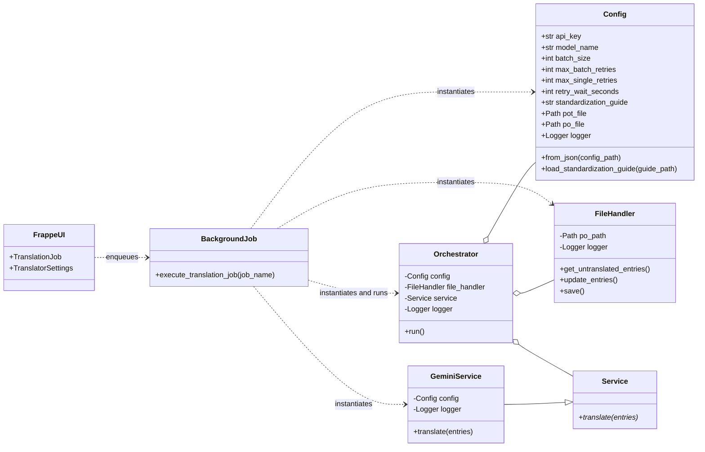
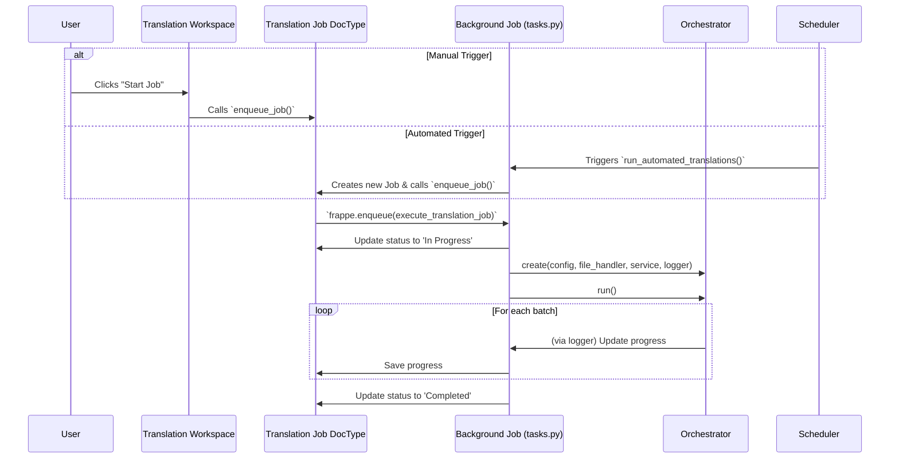

# Architecture Guide

This document describes the overall architecture and design principles of the `translation_hub` application.

## Design Principles

The system is designed following a **Layered Architecture** pattern. This separates concerns into distinct, independent components, making the codebase more modular, testable, and extensible.

The four main layers are:

1.  **Presentation Layer (Frappe UI)**: Handles user interaction through Frappe DocTypes and a custom Desk Page.
2.  **Application Layer (Frappe Backend)**: Manages the business logic, including DocType controllers, background jobs, and the scheduler.
3.  **Core Logic Layer**: Contains the domain-specific logic for the translation process. This layer is independent of the Frappe framework.
4.  **Service & Data Access Layer**: Manages external services (translation API) and filesystem interactions (`.po` files).

## Core Components

### Frappe Components

- **`Translator Settings` (Singleton DocType)**: Stores global configuration like API keys and automation settings. Replaces the old `config.json` file.
- **`Translation Job` (Standard DocType)**: Represents a single translation task, tracking its status, progress, and logs.
- **`Translation Workspace` (Desk Page)**: A UI dashboard for creating, managing, and monitoring `Translation Jobs`.
- **Background Job (`tasks.py`)**: A function that is enqueued by Frappe's scheduler or manually from the UI. It's responsible for running the core translation logic.

### Core Logic Components (Classes)

- **`Orchestrator`**: The "brain" of the application. It coordinates the entire translation process. It is instantiated and run by the background job.
- **`Service` (Abstract Base Class)**: Defines a common interface for any translation service.
- **`GeminiService`**: The concrete implementation of `Service` for the Google Gemini API.
- **`FileHandler`**: Encapsulates all logic related to file manipulation using the `polib` library.
- **`Config`**: A data class that holds all configuration parameters, populated from the `Translator Settings` DocType.
- **`DocTypeLogger`**: A custom logger that writes output to the `log` field of a `Translation Job` document.

## Execution Flow

The process can be triggered manually by a user or automatically by the Frappe scheduler.

