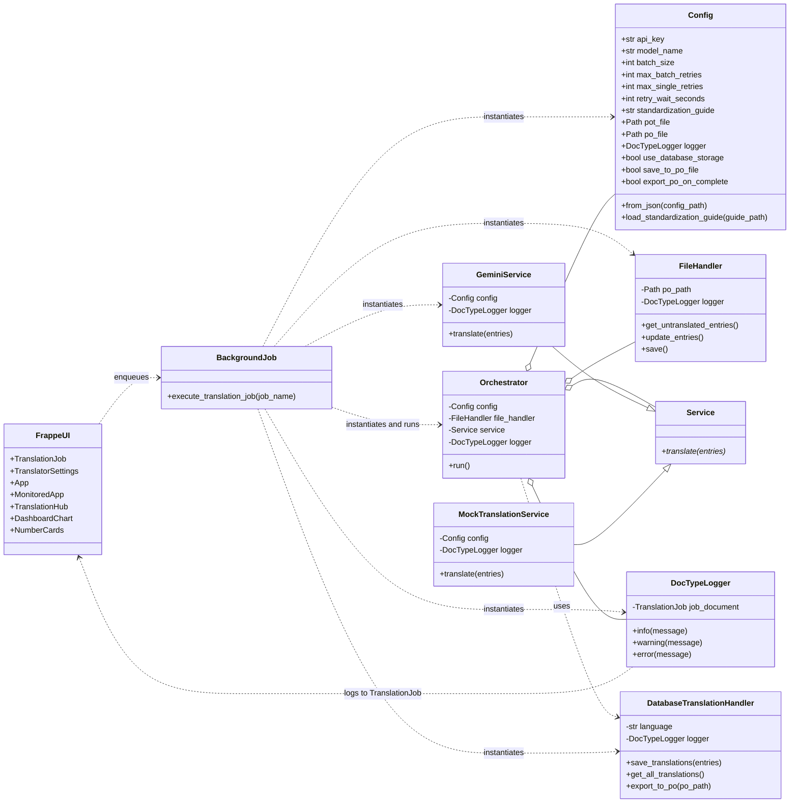
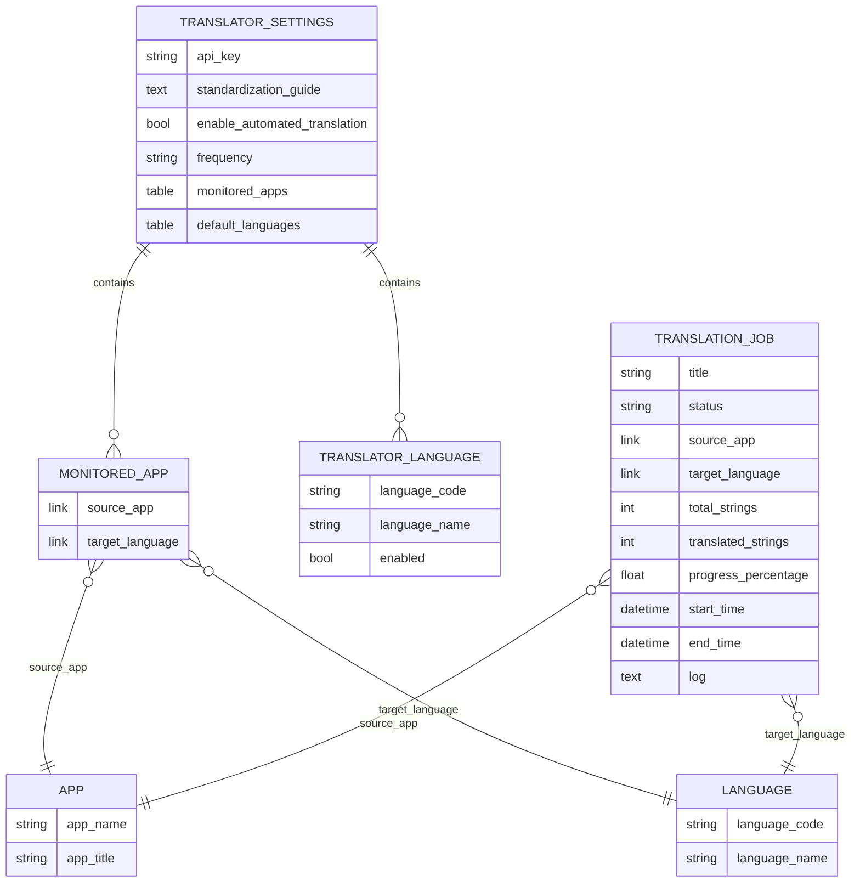
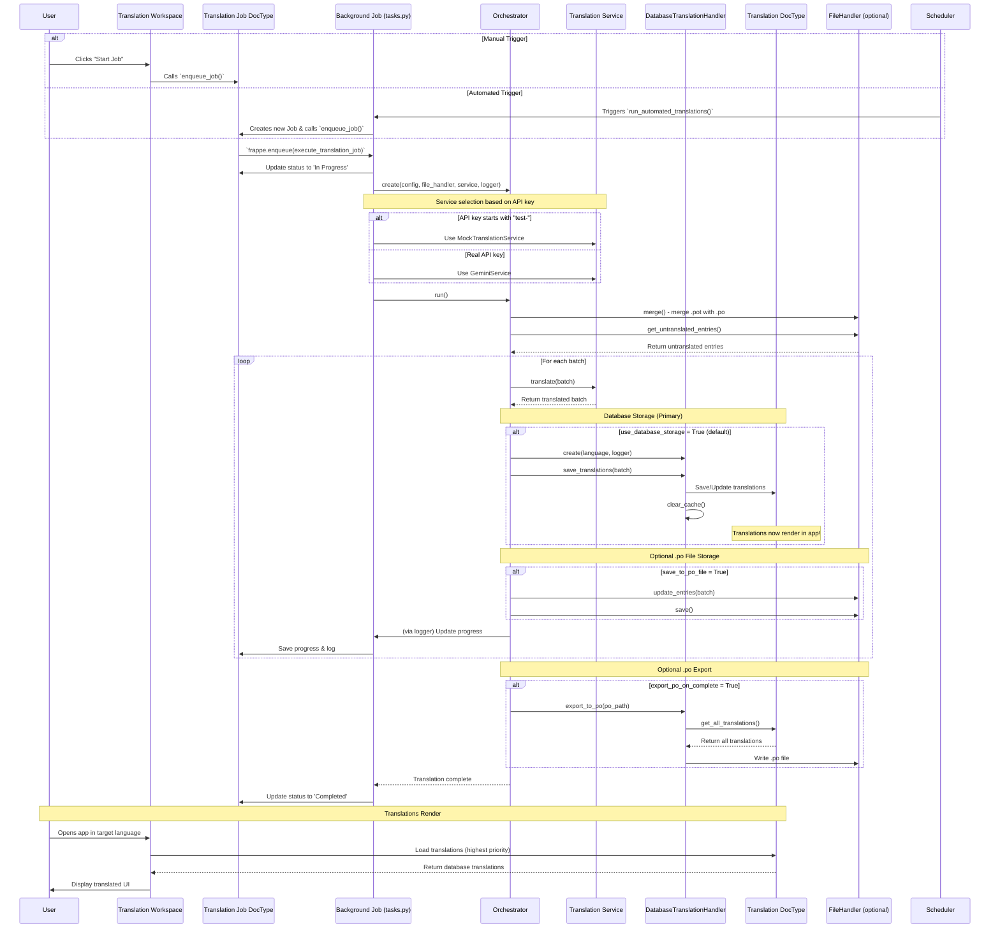

# Architecture Guide

This document describes the overall architecture and design principles of the `translation_hub` application.

## Design Principles

The system is designed following a **Layered Architecture** pattern. This separates concerns into distinct, independent components, making the codebase more modular, testable, and extensible.

The four main layers are:

1.  **Presentation Layer (Frappe UI)**: Handles user interaction through Frappe DocTypes and a custom Desk Page.
2.  **Application Layer (Frappe Backend)**: Manages the business logic, including DocType controllers, background jobs, and the scheduler.
3.  **Core Logic Layer**: Contains the domain-specific logic for the translation process. This layer is independent of the Frappe framework.
4.  **Service & Data Access Layer**: Manages external services (translation API) and filesystem interactions (`.po` files).

## Core Components

### Frappe Components

#### DocTypes

- **`Translator Settings` (Singleton DocType)**: Stores global configuration like API keys, automation settings, and monitored apps.
  - Contains child table `Monitored App` for automated translation configuration
  - Fields: `api_key`, `standardization_guide`, `enable_automated_translation`, `frequency`, `monitored_apps`

- **`Translation Job` (Standard DocType)**: Represents a single translation task, tracking its status, progress, timing, and logs.
  - Links to `App` (source application) and `Language` (target language)
  - Tracks progress metrics: `total_strings`, `translated_strings`, `progress_percentage`
  - Records timing: `start_time`, `end_time`
  - Maintains execution log for debugging and monitoring
  - Status values: Pending, Queued, In Progress, Completed, Failed, Cancelled

- **`App` (Standard DocType)**: Represents a Frappe/ERPNext application available for translation.
  - Stores `app_name` (unique identifier) and `app_title` (display name)
  - Referenced by `Translation Job` and `Monitored App`
  - Used to track which applications are being translated

- **`Monitored App` (Child Table)**: Defines app/language combinations to monitor for automated translation.
  - Part of `Translator Settings.monitored_apps`
  - Links to `App` (source application) and `Language` (target language)
  - Used by scheduler to automatically create translation jobs when untranslated strings are detected

#### Workspace & UI Components

- **`Translation Hub` (Workspace)**: A dashboard for creating, managing, and monitoring Translation Jobs.
  - Displays **Dashboard Charts**:
    - **"Translations Over Time"**: Visualizes translation activity over time.
    - **"Monitored Apps Progress"**: Shows the percentage of translation completion for each monitored app/language.
  - Displays **Number Cards** for key metrics:
    - **Total Apps Tracked**: Count of apps configured for translation
    - **Jobs in Progress**: Active translation jobs currently running
    - **Jobs Completed (30 Days)**: Successfully completed jobs in the last 30 days
    - **Strings Translated**: Total number of strings translated across all jobs

#### Background Jobs

- **Background Job (`tasks.py`)**: Functions enqueued by Frappe's scheduler or manually from the UI.
  - **`execute_translation_job(job_name)`**: Runs the translation process for a specific job
    - Updates job status (Queued → In Progress → Completed/Failed)
    - Instantiates and runs the `TranslationOrchestrator` with core logic components
    - Logs progress and errors to the job document
  - **`run_automated_translations()`**: Checks monitored apps and creates jobs automatically
    - Triggered by Frappe scheduler based on configured frequency
    - Scans for untranslated strings in monitored app/language combinations
    - Creates and enqueues new Translation Jobs when work is detected

### Core Logic Components (Classes)



### DocType Relationships

The following diagram shows how the Frappe DocTypes relate to each other:



### Component Descriptions

- **`Orchestrator`**: The "brain" of the application. It coordinates the entire translation process. It is instantiated and run by the background job. Now supports both database and file-based storage.
- **`Service` (Abstract Base Class)**: Defines a common interface for any translation service.
- **`GeminiService`**: The concrete implementation of `Service` for the Google Gemini API.
- **`MockTranslationService`**: A test implementation of `Service` that simulates translation without API calls. Automatically used when API key starts with `"test-"`.
- **`DatabaseTranslationHandler`**: Stores translations in Frappe's Translation DocType (database). Provides highest priority for rendering and Docker-safe persistence.
- **`FileHandler`**: Encapsulates all logic related to file manipulation using the `polib` library. Now optional, used only when `save_to_po_file=True`.
- **`Config`**: A data class that holds all configuration parameters, including storage options (`use_database_storage`, `save_to_po_file`, `export_po_on_complete`).
- **`DocTypeLogger`**: A custom logger that writes output to the `log` field of a `Translation Job` document.

### Database-First Approach

The Translation Hub uses a **database-first storage strategy** for translations, leveraging Frappe's built-in `Translation` DocType.

#### Why Database Storage?

1. **Docker-Safe**: Translations persist in the database, surviving container restarts
2. **Highest Priority**: Frappe loads translations in this order:
   - CSV files (legacy) - lowest priority
   - MO files (compiled .po) - medium priority
   - **Translation DocType** (database) - **highest priority** ✅
3. **Real-Time**: Changes apply immediately after cache clear
4. **Simple**: Uses Frappe's built-in infrastructure

#### Translation Loading Priority

```
User Opens App
    ↓
Frappe Loads Translations
    ↓
1. Load CSV Files (legacy)
    ↓
2. Load MO Files (.po compiled)
    ↓
3. Load Translation DocType (DATABASE) ← WINS!
    ↓
Merge All (database overrides files)
    ↓
Render in UI
```

**Result**: Database translations **always override** file-based translations!

### Configuration Options

The system supports three storage strategies via `TranslationConfig`:

#### Option 1: Database Only (Default - Recommended)

```python
use_database_storage = True   # Save to database
save_to_po_file = False        # Don't save .po files
export_po_on_complete = False  # Don't export
```

**Use Case**: Production deployment, Docker environments

**Benefits**:
- ✅ Simplest configuration
- ✅ Docker-safe persistence
- ✅ Real-time updates

#### Option 2: Database + .po Export

```python
use_database_storage = True   # Save to database
save_to_po_file = False        # Don't save during translation
export_po_on_complete = True   # Export at end
```

**Use Case**: Development, version control of translations

**Benefits**:
- ✅ Database persistence
- ✅ .po files for Git commits
- ✅ External tool compatibility

#### Option 3: Database + Real-time .po

```python
use_database_storage = True   # Save to database
save_to_po_file = True         # Also save .po files
export_po_on_complete = False  # Already saved
```

**Use Case**: Using external translation tools (Poedit, Weblate)

**Benefits**:
- ✅ Database persistence
- ✅ Real-time .po file updates
- ✅ Tool compatibility

### File Paths (Frappe v16)

Translations use the `locale/` directory structure:

```
/apps/{app_name}/{app_name}/
├── locale/
│   ├── main.pot          # Template file (always "main.pot")
│   ├── es.po             # Spanish translations
│   ├── pt_BR.po          # Portuguese (Brazil)
│   └── ...
```

**Note**: Changed from `translations/` (old) to `locale/` (Frappe v16 standard)


## Execution Flow

The process can be triggered manually by a user or automatically by the Frappe scheduler.



### Concurrency & Multi-Language Support

-   **Concurrency**: The system leverages Frappe's background workers. Multiple translation jobs can be enqueued simultaneously. The actual parallel execution depends on the number of available background workers in the Bench configuration.
-   **Multi-Language**: A single application can be translated into multiple languages simultaneously. Each App/Language pair is treated as a distinct `Translation Job` and `Monitored App` entry.
