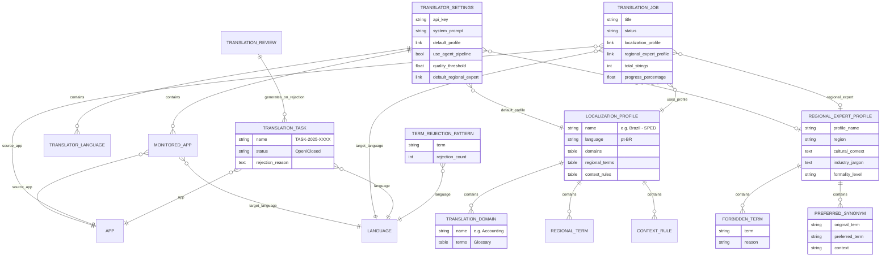

# Architecture Guide

This document describes the overall architecture and design principles of the `translation_hub` application.

## Recent Changes (v1.6.x - v2.0.x)

> [!NOTE]
> **Version 2.0.0** (2024-12-20): Multi-Agent Translation Pipeline with quality-first approach.
>
> **Version 1.7.0** (2024-12-18): File reorganization, Maintenance Module, GeminiService fix.
>
> **Version 1.6.1** (2024-12-15): Review Center UI overhaul, AI Feedback Loop, Deep Links, bug fixes.
>
> **Version 1.6.0** (2024-12-14): Major update with Language Manager UI, Selective Backup, Locale Cleanup, and Auto-compilation.

### Key Additions in Version 2.0.0

1. **Multi-Agent Translation Pipeline**:
   - **TranslatorAgent**: Domain-specific translation with ERP context
   - **RegionalReviewerAgent**: Cultural and regional adaptation using Regional Expert Profile
   - **QualityAgent**: Quality evaluation with automatic human review flagging
   - **AgentOrchestrator**: Coordinates the 3-agent pipeline

2. **Regional Expert Profile** (New DocType):
   - Rich cultural context for regional translations
   - **Forbidden Terms**: Terms to avoid with alternatives
   - **Preferred Synonyms**: Regional terminology preferences
   - **Industry Jargon**: Domain-specific terminology (JSON)
   - Works with existing Localization Profile

3. **Quality-First Approach**:
   - Translations evaluated before saving
   - Quality threshold (default 0.8) determines auto-approval
   - Low-quality translations flagged for human review
   - No automatic fallback - failures pause for inspection

4. **Translator Settings Enhancements**:
   - `use_agent_pipeline`: Enable/disable multi-agent pipeline
   - `quality_threshold`: Minimum quality score for auto-approval
   - `default_regional_expert`: Default Regional Expert Profile

### Key Additions in Release Candidate 2.0

1. **New Localization Engine**:
   - **Localization Profile**: Defines regional context (e.g., "Brazil - SPED") used to steer LLM translations.
   - **Translation Domain**: Manages industry-specific terminology (e.g., "Accounting", "Healthcare").
   - **Context Rules**: Regex-based rules for mandatory pattern replacements (e.g., `Return Against (.*)` -> `Devolução de \1`).

2. **Dual Review System**:
   - **Translation Task**: A dedicated DocType to track rejection fixes.
   - **Term Rejection Pattern**: Automatically identifies problematic terms based on frequent rejections.
   - **Auto-Review Logic**: Automatically approves translations that match the glossary or context rules.

3. **Workspace 2.0**:
   - Split between **Operational Workspace** (Shortcuts/Tasks) and **Analytics Dashboard** (Charts/Metrics).
   - Zero-Code Configuration via `Translator Settings` (Prompts, Keys).

### Key Additions in Previous Versions (v1.7.0)

1. **File Reorganization** - Moved loose scripts to proper module directories.
2. **Maintenance Module** - Smart utilities for system health.
3. **GeminiService Fix** - Improved API integration.

## Design Principles

The system is designed following a **Layered Architecture** pattern...

## Core Components

### Frappe Components

#### DocTypes

- **NEW `Localization Profile`**: The brain of the context engine. Stores language-specific rules and glossary links.
- **NEW `Translation Domain`**: Conceptual grouping for terms. Linked to Profiles.
- **NEW `Translation Task`**: Represents a unit of work for fixing a rejected translation.
- **NEW `Term Rejection Pattern`**: Stores learned patterns of "bad" translations to avoid repetition.

- **`Translator Settings`**: Now includes:
  - System Prompt editor (Small Text).
  - API Keys for Groq/OpenRouter/Gemini (Password).
  - Default Localization Profile selection.

- **`Translation Job`**: Now integrates with `Localization Profile` to fetch context before sending prompts to LLM.

- **`Translation Review`**: 
  - **Auto-Review**: New method `auto_review()` checks against Context Rules.
  - **Rejection Workflow**: Rejecting a review now creates a `Translation Task`.

  - Links to `Language` and `source_app`
  - Fields: `source_text`, `original_translation`, `corrected_translation`
  - **Learning Types**:
    - `General Correction`: Full translation corrections used as few-shot examples
    - `Term Correction`: Specific term mappings with `problematic_term` and `correct_term`
  - **Priority**: Term corrections are injected as "CRITICAL TERM RULES" in AI prompts
  - **Usage**: Automatically fetched by TranslationService to improve future translations

- **`App` (Standard DocType)**: Represents a Frappe/ERPNext application available for translation.
  - Stores `app_name` (Link to `Installed App`) and `app_title` (display name)
  - **Context Configuration**: Stores application-specific context for the LLM:
    - `domain` (e.g., Logistics, Healthcare)
    - `tone` (e.g., Formal, Friendly)
    - `description` (Brief app description)
    - `do_not_translate` (Child table of excluded terms)
  - **Validation**: Ensures only apps actually installed on the site can be registered.
  - Referenced by `Translation Job` and `Monitored App`

- **`App Glossary` (Standard DocType)**: Stores language-specific glossary terms for a specific App.
  - Links to `App` and `Language`
  - Contains child table `Glossary Items` (Term, Translation, Description)
  - Used to inject specific terminology into the translation context.

- **`Language Setup Item` (Child Table)**: NEW in v1.6.0 - Displays languages in Language Manager table.
  - Part of `Translator Settings.language_manager`
  - Fields: `language_code`, `language_name`, `enabled`
  - Auto-populated from .po files and Language DocType
  - Synced to Language DocType on save

- **`Installed App` (Virtual DocType)**: A virtual resource that dynamically lists all apps installed on the current Frappe site.
  - Wraps `frappe.get_installed_apps()`
  - Used as the data source for the `App` DocType's `app_name` field to improve UX and prevent errors.

- **`Monitored App` (Child Table)**: Defines app/language combinations to monitor for automated translation.
  - Part of `Translator Settings.monitored_apps`
  - Links to `App` (source application) and `Language` (target language)
  - Used by scheduler to automatically create translation jobs when untranslated strings are detected

#### Workspace & UI Components

- **`Translation Hub` (Workspace)**: A dashboard for creating, managing, and monitoring Translation Jobs.
  - Displays **Dashboard Charts**:
    - **"Translations Over Time"**: Visualizes translation activity over time.
    - **"Monitored Apps Progress"**: Shows the percentage of translation completion for each monitored app/language.
  - Displays **Number Cards** for key metrics:
    - **Total Apps Tracked**: Count of apps configured for translation
    - **Jobs in Progress**: Active translation jobs currently running
    - **Jobs Completed (30 Days)**: Successfully completed jobs in the last 30 days
    - **Strings Translated**: Total number of strings translated across all jobs

#### Reports

- **`Monitored Apps Progress Report` (Script Report)**: Calculates the translation progress for monitored apps.
  - Used as the data source for the "Monitored Apps Progress" dashboard chart.
  - Logic located in `translation_hub/report/monitored_apps_progress_report/monitored_apps_progress_report.py`.

#### Background Jobs

- **Background Job (`tasks.py`)**: Functions enqueued by Frappe's scheduler or manually from the UI.
  - **`execute_translation_job(job_name)`**: Runs the translation process for a specific job
    - Updates job status (Queued → In Progress → Completed/Failed)
    - Instantiates and runs the `TranslationOrchestrator` with core logic components
    - Logs progress and errors to the job document
  - **`run_automated_translations()`**: Checks monitored apps and creates jobs automatically
    - Triggered by Frappe scheduler based on configured frequency
    - Scans for untranslated strings in monitored app/language combinations
    - Creates and enqueues new Translation Jobs when work is detected

### Core Logic Components (Classes)


### DocType Relationships

The following diagram shows how the Frappe DocTypes relate to each other:



### Component Descriptions

- **`Orchestrator`**: The "brain" of the application. It coordinates the entire translation process. It is instantiated and run by the background job. Now supports both database and file-based storage, and can delegate to `AgentOrchestrator` when agent pipeline is enabled.
- **`AgentOrchestrator`** (NEW in v2.0): Coordinates 3 specialized agents for quality-first translation. Manages the pipeline: TranslatorAgent → RegionalReviewerAgent → QualityAgent.
- **`TranslatorAgent`**: Domain-specific translation with ERP context injection.
- **`RegionalReviewerAgent`**: Applies cultural and regional adjustments based on Regional Expert Profile.
- **`QualityAgent`**: Evaluates translation quality and flags low-score translations for human review.
- **`Service` (Abstract Base Class)**: Defines a common interface for any translation service.
- **`GeminiService`**: The concrete implementation of `Service` for the Google Gemini API. Handles **Context Injection** by fetching app-specific details (domain, tone, glossary) and embedding them into the LLM prompt.
- **`GroqService`**: An alternative implementation of `Service` that uses Groq's fast inference API. Uses the OpenAI-compatible SDK to call Groq endpoints. Supports models like `llama-3.3-70b-versatile` and `mixtral-8x7b-32768`. Selected via the `llm_provider` setting in Translator Settings.
- **`MockTranslationService`**: A test implementation of `Service` that simulates translation without API calls. Automatically used when API key starts with `"test-"`.
- **`DatabaseTranslationHandler`**: Stores translations in Frappe's Translation DocType (database). Provides highest priority for rendering and Docker-safe persistence.
- **`FileHandler`**: Encapsulates all logic related to file manipulation using the `polib` library. Handles merging `.pot` templates into `.po` files and saving translations.
- **`Config`**: A data class that holds all configuration parameters, including storage options (`use_database_storage`, `save_to_po_file`, `export_po_on_complete`) and agent pipeline options (`use_agent_pipeline`, `quality_threshold`, `regional_expert_profile`).
- **`DocTypeLogger`**: A custom logger that writes output to the `log` field of a `Translation Job` document.
- **`GitSyncService`**: Manages Git-based backup and restore of translation files. Handles repository cloning, file synchronization, commits, and pushes to remote repositories.

### Translation Backup & Restore

The Translation Hub includes a Git-based backup system to persist translations across instances and facilitate disaster recovery.

#### GitSyncService

The `GitSyncService` class provides automated backup and restore functionality:

**Features:**
- **Repository Management**: Clones and syncs with remote Git repositories
- **File Collection**: Gathers `.po` files from all monitored apps
- **Directory Structure**: Organizes backups by version and app (`version/app_name/locale/*.po`)
- **Authentication**: Supports Personal Access Tokens (PAT) for private repositories
- **Automatic Commits**: Creates timestamped commits with `[skip ci]` tag
- **NEW in v1.6.0 - Selective Language Backup**: Only backs up/restores enabled languages
  - Filters by Language DocType `enabled` field
  - Significantly reduces repository size
  - Improves backup/restore performance
- **NEW in v1.6.1 - PO to Database Import**: Automatically imports restored .po files to Translation database
  - Parses .po files with `polib`
  - Populates `tabTranslation` for Translation Review functionality
  - Only imports enabled languages
- **NEW in v1.6.1 - Automatic Compilation**: Compiles .po to .mo files after restore
  - Uses `frappe.gettext.translate.compile_translations()`
  - Translations immediately available without manual `bench build`

**Configuration** (in Translator Settings):
- `backup_repo_url`: HTTPS URL of the Git repository
- `backup_branch`: Branch to use (default: `main`)
- `auth_token`: Personal Access Token for authentication
- `backup_frequency`: Automated backup schedule (None/Daily/Weekly)

**Storage Location**: `sites/[site_name]/private/translation_backup_repo`

**Repository Structure:**
```
translation-backup-repo/
├── version-16/  # Only major version for consistency
│   ├── frappe/
│   │   └── locale/
│   │       ├── pt_BR.po    # Only enabled languages
│   │       └── es.po
│   ├── erpnext/
│   │   └── locale/
│   │       └── pt_BR.po
│   └── custom_app/
│       └── locale/
│           └── pt_BR.po
```

**Usage:**
- **Manual Backup**: Click "Backup Translations" button in Translator Settings
  - Optional: Select specific apps to backup
- **Manual Restore**: Click "Restore Translations" button in Translator Settings
  - Optional: Select specific apps to restore
  - Automatically imports to database
  - Automatically compiles .mo files
- **Automated**: Configure `backup_frequency` for scheduled backups
- **Locale Cleanup**: NEW in v1.6.0 - Remove .po files of disabled languages
  - "Cleanup Locale Directories" button
  - Confirmation dialog for safety
  - Preserves _test.po files


### Database-First Approach & HTML Preservation

The Translation Hub uses a **database-first storage strategy** for translations, leveraging Frappe's built-in `Translation` DocType.

#### Why Database Storage?

1. **Docker-Safe**: Translations persist in the database, surviving container restarts
2. **Highest Priority**: Frappe loads translations in this order:
   - CSV files (legacy) - lowest priority
   - MO files (compiled .po) - medium priority
   - **Translation DocType** (database) - **highest priority** ✅
3. **Real-Time**: Changes apply immediately after cache clear
4. **Simple**: Uses Frappe's built-in infrastructure

#### HTML Preservation Strategy

> [!IMPORTANT]
> The `Translation` DocType automatically strips HTML tags from the `source_text` field for security. This can cause data loss if you rely solely on exporting from the database back to `.po` files.

To preserve rich text (HTML) in your translations:
1.  **Enable `save_to_po_file`**: This saves translations directly to the `.po` file in real-time, bypassing the database's HTML stripping.
2.  **Disable `export_po_on_complete`**: Prevent the database (which has stripped HTML) from overwriting the correct `.po` file at the end of the job.

#### Translation Loading Priority

```
User Opens App
    ↓
Frappe Loads Translations
    ↓
1. Load CSV Files (legacy)
    ↓
2. Load MO Files (.po compiled)
    ↓
3. Load Translation DocType (DATABASE) ← WINS!
    ↓
Merge All (database overrides files)
    ↓
Render in UI
```

**Result**: Database translations **always override** file-based translations!

### Configuration Options

The system supports three storage strategies via `TranslationConfig`:

#### Option 1: Database Only (Default - Recommended)

```python
use_database_storage = True   # Save to database
save_to_po_file = False        # Don't save .po files
export_po_on_complete = False  # Don't export
```

**Use Case**: Production deployment, Docker environments

**Benefits**:
- ✅ Simplest configuration
- ✅ Docker-safe persistence
- ✅ Real-time updates

#### Option 2: Database + .po Export

```python
use_database_storage = True   # Save to database
save_to_po_file = False        # Don't save during translation
export_po_on_complete = True   # Export at end
```

**Use Case**: Development, version control of translations (Plain text only)

**Benefits**:
- ✅ Database persistence
- ✅ .po files for Git commits
- ✅ External tool compatibility
- ⚠️ **Warning**: HTML tags will be stripped from source text in the exported file.

#### Option 3: Database + Real-time .po (Recommended for Rich Text)

```python
use_database_storage = True   # Save to database
save_to_po_file = True         # Also save .po files
export_po_on_complete = False  # Already saved
```

**Use Case**: Using external translation tools (Poedit, Weblate) or translating HTML content.

**Benefits**:
- ✅ Database persistence
- ✅ Real-time .po file updates
- ✅ Tool compatibility
- ✅ **Preserves HTML tags**

### File Paths (Frappe v16)

Translations use the `locale/` directory structure:

```
/apps/{app_name}/{app_name}/
├── locale/
│   ├── main.pot          # Template file (always "main.pot")
│   ├── es.po             # Spanish translations
│   ├── pt_BR.po          # Portuguese (Brazil)
│   └── ...
```

**Note**: Changed from `translations/` (old) to `locale/` (Frappe v16 standard)


## Execution Flow

The process can be triggered manually by a user or automatically by the Frappe scheduler.


-   **Multi-Language**: A single application can be translated into multiple languages simultaneously. Each App/Language pair is treated as a distinct `Translation Job` and `Monitored App` entry.

### Agent Pipeline Flow (v2.0)

When `use_agent_pipeline` is enabled, the Orchestrator delegates translation to the AgentOrchestrator, which coordinates 3 specialized agents:


The quality of translation depends heavily on the context provided to the LLM. The system aggregates context from multiple sources to create a comprehensive `Standardization Guide`.


## AI Review Workflow

The v1.4.0 update introduces an AI-assisted review workflow, allowing the AI to act as a reviewer/suggester rather than just a translator.


